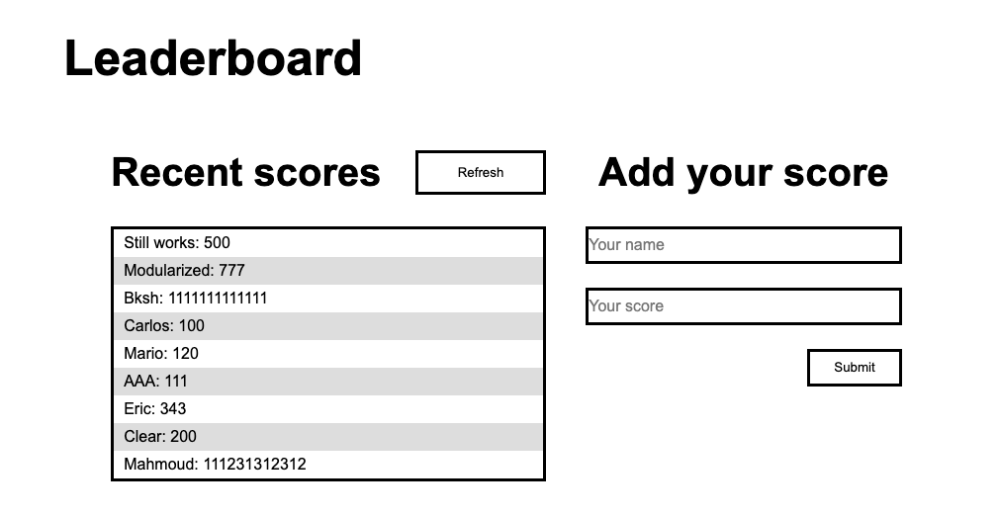

# Leaderboard

> A minimalist Leaderboard app



## Getting Started

### Prerequisites

- [Webpack](https://webpack.js.org/)

### Setup

* Clone this repository
```
git clone https://github.com/crgc/microverse-leaderboard.git
```
* Change into folder
```
cd microverse-leaderboard
```
* Install Webpack
```
npm install webpack webpack-cli --save-dev
```
* Install dependencies
```
npm install --save-dev style-loader css-loader
npm install --save-dev html-webpack-plugin
npm install --save-dev copy-webpack-plugin
npm install --save-dev webpack-dev-server
```

### Run
* Build
```
npm run build
```
* Start server
```
npm start
```
* Open your browser at http://localhost:8080/

## Built With

- HTML5 & CSS3
- Javascript
- Webpack

## Authors

👤  **Carlos González**
- GitHub: [@crgc](https://github.com/crgc)
- Twitter: [@aclerkofpomier](https://twitter.com/aclerkofpomier)
- LinkedIn: [Carlos González](https://www.linkedin.com/in/carlosrmgonzalez/)

## Show your support

Give a ⭐️ if you like this project!

## Acknowledgments

- Microverse

## 📝 License

This project is [MIT](https://www.mit.edu/~amini/LICENSE.md) licensed.